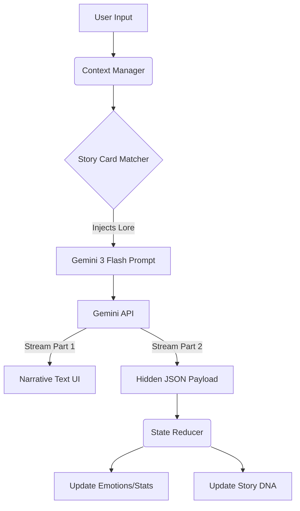

# Chronos: AI Story Engine 

> **A stateful, event-sourced narrative engine powered by Google Gemini 3 Flash.**
> *Submitted for the Gemini 3 Hackathon*


##  The Problem
Most AI roleplay apps are passive "chatbots." They wait for the user to speak, have no sense of pacing, and often forget critical context. They are **participants**, not **directors**.

##  The Solution: Chronos
Chronos is a **Narrative Engine** that treats the AI not just as a character, but as a **Dungeon Master**. It tracks invisible variables—Character Trust, Global Tension, Story DNA (Order vs. Chaos)—and allows the user to intervene via a **Director Mode** to force plot twists.

Powered by **Gemini 3 Flash**, Chronos achieves a "Dual-Phase" generation: streaming the story text to the user while simultaneously calculating complex JSON state updates in the background, all in a single low-latency turn.

##  Key Features

### 1.  Director Mode (The "Wow" Factor)
Unlike standard chat, you have a control panel.
- **Tension Control:** Slide a bar to 100% to force the AI to make the scene dangerous.
- **Pacing Control:** Switch between "Slow" (atmospheric) and "Fast" (action-oriented).
- **Twist Injection:** Click a button to force a betrayal or sudden event immediately.

### 2.  Stateful Entities
Characters aren't just text. They have stats that persist and evolve:
- **Emotional Tracking:** `Trust`, `Fear`, `Anger`, and `Hope` values update dynamically based on your actions.
- **Status Effects:** Characters can become "Injured", "Unconscious", or "Deceased."
- **Story DNA:** The engine tracks the thematic tone of the story (e.g., shifting from "Order" to "Chaos").

### 3.  Gemini 3 "Dual-Phase" Streaming
We utilize the speed of `gemini-3-flash-preview` to perform a complex architecture:
1.  **Phase 1 (Narrative):** The model streams the story text for immediate user feedback.
2.  **Phase 2 (State Calculation):** In the *same generation*, the model outputs a hidden JSON payload containing world updates, preventing the need for multiple API calls.

### 4.  Story Cards (Context Injection)
To handle long context efficiently, Chronos uses a "Story Card" system.
- Define lore items (e.g., "The Magic Sword") with keywords.
- When those keywords appear in chat, the relevant lore is dynamically injected into Gemini's context window.

---

##  Technical Architecture

Chronos is built with **React**, **TypeScript**, and the **Google Gen AI SDK**.



### Core Code Highlight (`geminiService.ts`)

We use a specific separator strategy to handle streaming text and JSON data in one request:

```typescript
// The prompt asks Gemini to output story text, then a separator, then JSON state.
for await (const chunk of responseStream) {
  if (!narrativeFinished) {
    // Stream text to UI immediately
  } else {
    // Buffer JSON state updates
  }
}

```

---

##  Installation & Setup

1. **Clone the repository**
```bash
git clone [https://github.com/aryansherigar/agent-rp.git](https://github.com/aryansherigar/agent-rp.git)
cd agent-rp

```


2. **Install dependencies**
```bash
npm install

```


3. **Configure Environment**
Create a `.env` file in the root directory:
```env
GEMINI_API_KEY=your_google_ai_studio_key_here

```


4. **Run the Development Server**
```bash
npm run dev

```


Open `http://localhost:3000` to start the engine.

---

##  Hackathon Judging Criteria

###  Technical Execution

* **Gemini 3 Integration:** Uses `gemini-3-flash-preview` for high-speed token generation required for the "Dual-Phase" streaming.
* **Complex State Management:** Implements a custom `useReducer` engine (`App.tsx`) to handle event-sourced updates from the AI.

###  Innovation

* **Director Overlay:** Shifts the paradigm from "Chat with AI" to "Direct the AI."
* **Story DNA:** Visualizes the abstract "vibe" of a story using concrete data visualization.

###  Potential Impact

* **Education:** Can be used to simulate historical scenarios where students "direct" the outcome.
* **Gaming:** A backend engine for infinite RPGs.
* **Therapy:** Safe scenarios to practice social interactions with emotional feedback loops (Trust/Fear meters).

---

*Built with ❤️ by Aryan Sherigar for the Gemini 3 Hackathon.*

