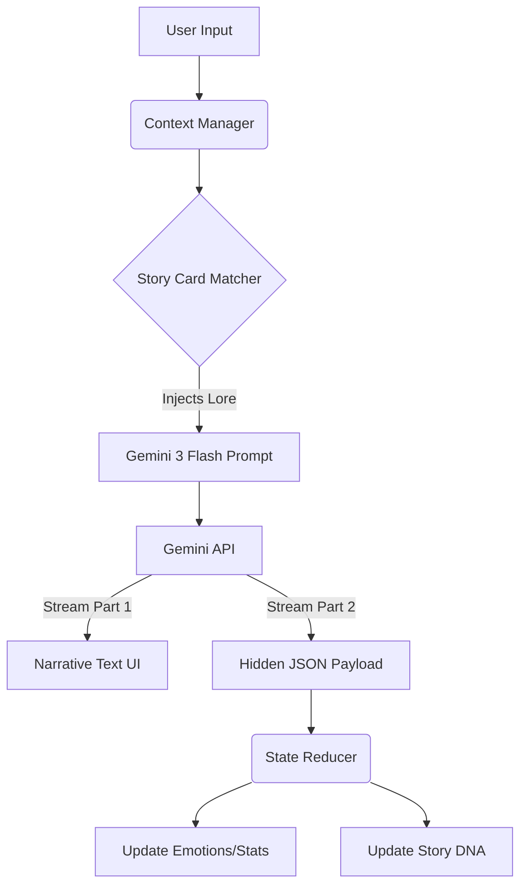

# Chronos: The Director-Driven AI Story Engine


Chronos is a stateful, event-sourced narrative roleplaying engine powered by Google Gemini 3 Flash. It acts as a proactive AI Dungeon Master that tracks hidden variables like character psychology, global tension, and story themes in real-time.

**[🚀 Play the Live Demo](https://rp-agent.vercel.app)**


## Motivation

I play AI Dungeon a lot, but I kept running into a major problem: the AI is incredibly passive and forgetful. It struggles to keep track of characters, and it completely loses track of their emotions from one scene to the next.

I was frustrated trying to play out long stories where the AI would forget who was angry at me or who I had built trust with.

I wanted an experience where the AI didn't just passively react to my prompts, but actively managed a cohesive, living world. I built Chronos to solve this.

It is engineered to maintain strict psychological states for NPCs, remember hidden lore, and actively direct the pacing of the story based on measurable data.

## Quick Start

Get Chronos running locally in just a few steps:

### 1. Clone the Repository

```bash
git clone https://github.com/aryansherigar/agent-rp.git
cd agent-rp
```

### 2. Install Dependencies

```bash
npm install
```

### 3. Configure Environment

Create a `.env` file in the root directory and add your Google AI Studio key:

```env
GEMINI_API_KEY=your_google_ai_studio_key_here
```

### 4. Run the Engine

```bash
npm run dev
```

Navigate to `http://localhost:3000` to access Mission Control and initialize your first simulation!

## Usage

Chronos offers advanced features designed to give you unprecedented control over the AI's narrative generation.

### The Director Overlay

You don't just play Chronos; you direct it. Toggle the "Director" mode to access the master control panel:

- **Tension & Pacing:** Use real-time sliders to force the AI to speed up the action or increase the scene's danger level.
- **The Twist Button:** Click the "⚡ Twist" button to instantly override the AI's current trajectory, forcing a sudden betrayal, shocking revelation, or immediate threat into the next generated response.

### Custom Protocols (World Building)

You aren't limited to premade templates. Use the **Protocol Configuration** interface to engineer entirely custom scenarios.

- Define the exact setting, premise, and overarching world parameters.
- Create custom entities (characters) with specific roles, emotional baselines (Trust, Fear, Anger, Hope), and hidden "Lore/Secrets".
- When you interact with these characters, the engine dynamically retrieves their secrets and injects them into the prompt context to keep the AI strictly grounded in your world's reality.

## AI Engineering & Architecture

Chronos is built to demonstrate advanced LLM orchestration techniques:

- **Dual-Phase Streaming:** To provide instant UI feedback while maintaining complex state variables, Chronos forces the Gemini 3 Flash model to output a continuous stream of narrative text, followed by a `___METADATA___` separator, and finally a structured JSON payload. This allows the system to extract character stat updates and "Story DNA" shifts in the background—all from a single, low-latency API call.

- **Contextual Story Cards (RAG Pattern):** To manage context windows efficiently, the engine monitors user input and recent history for specific keywords. When a match occurs, it pulls the relevant "Story Card" and injects targeted lore directly into the system prompt, ensuring the AI remembers critical facts without bloating the token count.

- **Event-Sourced State:** The entire simulation is managed via a strict React `useReducer` pattern, turning the LLM's structured JSON outputs into predictable, math-based state updates for the UI.

##  Technical Architecture

Chronos is built with **React**, **TypeScript**, and a server-side **Google Gen AI SDK** integration.


```mermaid
graph TD
    A[User Input] --> B(Context Manager)
    B --> C{Story Card Matcher}
    C -->|Injects Lore| D[Gemini 3 Flash Prompt]
    D --> E[Gemini API]
    E -->|Stream Part 1| F[Narrative Text UI]
    E -->|Stream Part 2| G[Hidden JSON Payload]
    G --> H(State Reducer)
    H --> I[Update Emotions/Stats]
    H --> J[Update Story DNA]

```
---

Built By Aryan Keshav Sherigar
